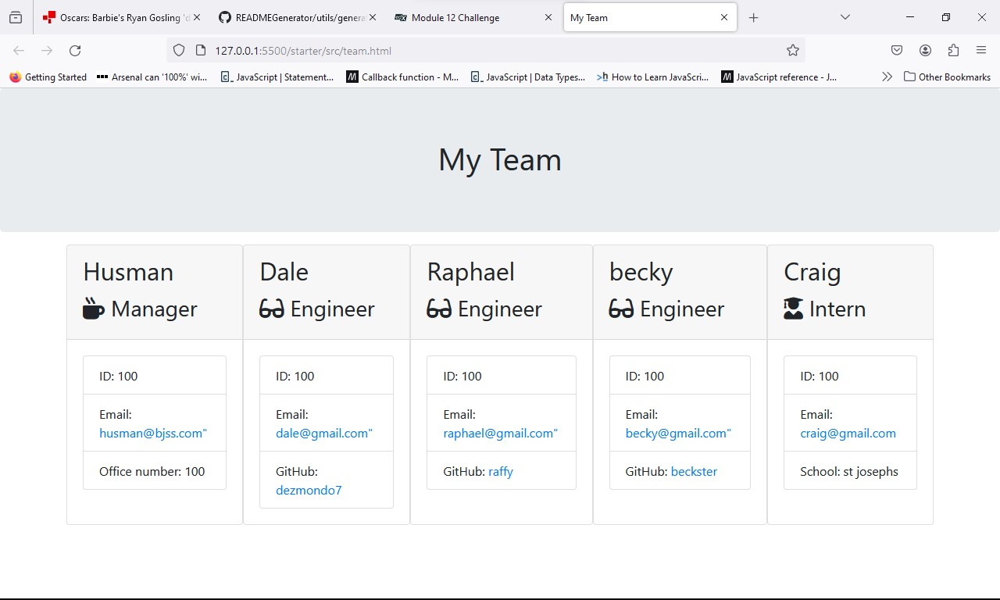

# Team Profile Generator

## Description

This project was to use NodeJS and OOP to create a Team profile generator. The user/employee enters their managers details and adds team memeber into the console which then generates a HTML page based on the user's input.

## Installation

This project required FS Inquirer and Jest to be installed

## Use

The application automates the build of a Team Profile Generator file based on the users input

## Application

Here is a link to the Github URL: https://github.com/Dezmondo7/TeamGenerator 

Below is an image of the final working application 

## Licenses
N/A

